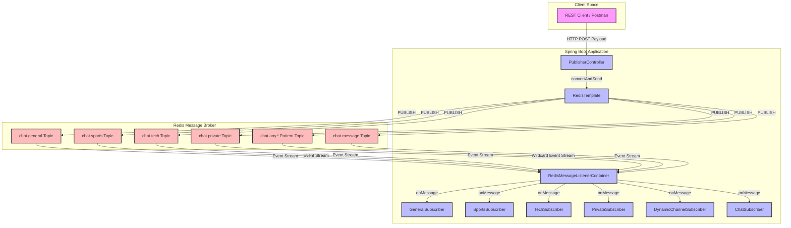
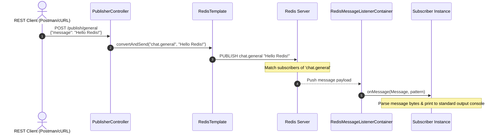

# 🚀 Spring Boot Redis Pub/Sub Demo

A modern, lightweight Spring Boot demonstration application showcasing real-time messaging using **Redis Publish/Subscribe (Pub/Sub)** infrastructure. This project displays how to distribute messages across multiple channels, handle dynamic subscriptions using wildcard pattern matching, and serialize message payloads.

---

## 📐 System Architecture

### Component Diagram
The system follows a typical Pub/Sub publisher-subscriber pattern where publishers and subscribers are decoupled. The Spring Boot application serves as both the REST endpoint provider (Publisher) and the Message Listener container (Subscriber), utilizing **Redis** as the message broker.



### Message Life Cycle Sequence
The sequence diagram below displays the end-to-end flow of a message published via the REST API to subscribers.



---

## 🌟 Key Features

* **Multiple Channel System**: Distribute messages to specific silos like General, Sports, Tech, and Private.
* **Pattern-Based Dynamic Subscription**: Subscribe dynamically to channel families using wildcard matching (e.g., `chat.any.*` via `DynamicChannelSubscriber`).
* **Broadcasting Capabilities**: Fan out a single inbound message to multiple channels simultaneously.
* **Payload Serialization**: Utilizes `StringRedisSerializer` and `JacksonJsonRedisSerializer` to handle payload transformation natively.
* **Robust Listener Management**: Handles thread pooling and connection recovery automatically through `RedisMessageListenerContainer`.

---

## 🛠️ Tech Stack & Requirements

* **Language**: Java 17+
* **Framework**: Spring Boot 3.x, Spring Data Redis
* **Message Broker**: Redis (Local Server / WSL / Docker Container)
* **Build System**: Maven
* **Utilities**: Lombok, Jackson

---

## ⚡ Quick Start

### 1. Run Redis Broker
The easiest way to boot up a Redis instance is using **Docker**:
```bash
docker run --name redis-pubsub-demo -p 6379:6379 -d redis
```
Alternatively, start the native service on Windows/WSL or Linux:
```bash
sudo service redis-server start
```

### 2. Configure the Application
Open `src/main/resources/application.properties` (or `application.yml`) to adjust your connection properties:
```properties
spring.data.redis.host=localhost
spring.data.redis.port=6379
```

### 3. Run the Spring Boot App
Navigate to the root directory and run:
```bash
mvn spring-boot:run
```
Or use the Maven Wrapper:
* **Windows**: `mvnw.cmd spring-boot:run`
* **Linux/WSL**: `./mvnw spring-boot:run`

---

## 🔌 API Endpoints & Usage Examples

Here are the endpoints available of the `PublisherController` mapped under `/publish`:

| HTTP Method | Endpoint | Description | Sample Payload |
| :--- | :--- | :--- | :--- |
| **POST** | `/publish/general` | Publish to `chat.general` channel | `{"message": "Hello general group!"}` |
| **POST** | `/publish/sports` | Publish to `chat.sports` channel | `{"message": "Ready for the big game?"}` |
| **POST** | `/publish/tech` | Publish to `chat.tech` channel | `{"message": "New AI models released"}` |
| **POST** | `/publish/private` | Publish to `chat.private` channel | `{"message": "Encrypted workspace message"}` |
| **POST** | `/publish/any/{channel}` | Custom tag routing (matches `chat.any.*`) | `{"message": "Dynamic payload content"}` |
| **POST** | `/publish/broadcast` | Unified fan-out to all core channels | `{"message": "System-wide alert!"}` |
| **POST** | `/publish/detailed` | Structured message detailing sender & topic | `{"channel":"tech","sender":"Antigravity","message":"Publishing payload"}` |

### cURL Snippets

#### 📣 Publish to General Channel
```bash
curl -X POST http://localhost:8080/publish/general \
     -H "Content-type: application/json" \
     -d '{"message": "Hello everyone on the general channel!"}'
```

#### 📬 Publish Custom Topic (Dynamic Matcher)
Channels passed to `/publish/any/{channel}` map internally to `chat.any.{channel}` which matches the `chat.any.*` subscription.
```bash
curl -X POST http://localhost:8080/publish/any/gaming \
     -H "Content-type: application/json" \
     -d '{"message": "New patch notes are live!"}'
```

#### 📡 Broadcast Message
```bash
curl -X POST http://localhost:8080/publish/broadcast \
     -H "Content-type: application/json" \
     -d '{"message": "System-wide database maintenance in 10 minutes."}'
```

---

## 🖥️ Console Output Verification

When you trigger the endpoints above, you will see real-time listener reactions in your local console:

```text
📢 [GENERAL] Message: "Hello everyone on the general channel!"
   Channel: chat.general
   ---

📬 [DYNAMIC] Channel: chat.any.gaming
   Message: "New patch notes are live!"
   ---

📢 [GENERAL] Message: "System-wide database maintenance in 10 minutes."
   Channel: chat.general
   ---
```
